# 🏥 MediConnect: Smart Healthcare Assistant & Administration Platform

A production-grade, full-stack healthcare ecosystem featuring **patient appointment scheduling**, **AI symptom diagnosis**, **emergency blood bank coordination**, **multi-gateway payment processing (Stripe & Razorpay)**, and a **comprehensive Admin Control Portal**.

---

## 🏛️ System Architecture

```mermaid
graph TD
    %% Client Tier
    subgraph ClientTier [Frontend Client Tier - Vercel Edge / CDN]
        UI_P[Patient Portal: Booking, AI Symptom Diagnosis, Payments]
        UI_D[Doctor Portal: Visits, Verification, Profile Schedule]
        UI_A[Admin Control Hub: Onboarding, Ledger, Moderation, Broadcast]
    end

    %% Ingress & Load Balancing Tier
    subgraph IngressTier [Traffic Ingress & Load Balancing]
        LB[Render / Cloudflare Load Balancer & Reverse Proxy]
        HEALTH[Health Check Probe: /health]
    end

    %% Application Server Tier
    subgraph AppTier [Backend Service Tier - Node.js / Express]
        API_AUTH[Authentication & JWT Middleware]
        API_ADMIN[Admin Management & Analytics Controller]
        API_USER[User & Appointment Engine]
        API_DOCTOR[Doctor Schedule & Code Verification]
        API_BLOOD[Emergency Blood Bank Controller]
        API_PAY[Stripe & Razorpay Payment Webhooks]
    end

    %% Database Tier
    subgraph DataTier [Data Tier - MongoDB Atlas Cluster]
        DB_USERS[(Users: Patients, Doctors, Admins)]
        DB_APPTS[(Appointments & Transactions)]
        DB_BLOOD[(Blood Requests)]
        DB_DIAG[(AI Diagnosis Records)]
        DB_SETTINGS[(Site & Emergency Settings)]
    end

    %% Third Party Services
    subgraph ExternalServices [External Integrations]
        STRIPE[Stripe Checkout API]
        RAZORPAY[Razorpay Orders API]
    end

    %% Connections
    UI_P & UI_D & UI_A -->|HTTPS / REST API| LB
    HEALTH -.->|Liveness / Readiness Probe| LB
    LB -->|Reverse Proxy / Round Robin| API_AUTH & API_ADMIN & API_USER & API_DOCTOR & API_BLOOD & API_PAY

    API_AUTH & API_ADMIN & API_USER & API_DOCTOR & API_BLOOD & API_PAY -->|Mongoose ODM| DB_USERS & DB_APPTS & DB_BLOOD & DB_DIAG & DB_SETTINGS

    API_PAY -->|Payment Intents / Verification| STRIPE & RAZORPAY
```



---

## 🧩 Architectural Layers & Responsibilities

### 1. 🖥️ Client Tier (React 18 + Vite + Redux Toolkit + Tailwind CSS + Ant Design)
* **Single Page Application (SPA)** with responsive layouts, fluid animations (`framer-motion`), and role-based route protection (`ProtectedRoute` & `PublicRoute`).
* **Dynamic API Gateway Resolution**: Automatically points to local dev or live cloud production servers (`VITE_SERVER_URL`).
* **SPA Rewrite Engine**: Configured with [`vercel.json`](file:///c:/Users/Acer/OneDrive/Desktop/Smart%20Healthcare%20webapp/client/vercel.json) to eliminate 404 errors on browser page reloads.

### 2. ⚖️ Ingress & Load Balancer Tier (Render / Cloudflare)
* **Reverse Proxy Trust**: Node/Express configured with `app.set('trust proxy', 1)` to accurately detect real client IPs, protocol schemes, and forwarded headers.
* **Health Probes**: Automated health checks via `/health` for dynamic instance rotation and zero-downtime rolling deploys.
* **Horizontal Auto-Scaling**: CPU and memory threshold auto-scaling (`minInstances: 1`, `maxInstances: 3`) defined in [`render.yaml`](file:///c:/Users/Acer/OneDrive/Desktop/Smart%20Healthcare%20webapp/render.yaml).

### 3. ⚙️ Application Logic Tier (Express.js RESTful API)
* **Security & Auth**: JWT Bearer token verification, bcrypt hashing, and sanitization filters.
* **CORS Ingress Controller**: Seamlessly validates incoming origins (`localhost`, custom domains, and all `*.vercel.app` deployments).
* **Multi-Route Fallback Adapters**: Universal API routing accepting `/api/v1/*`, `/api/*`, and root endpoints.

### 4. 🗄️ Data Storage Tier (MongoDB Atlas Cloud Cluster)
* Highly resilient cloud cluster storing normalized schemas for Users, Appointments, Blood Requests, and Platform Configuration.

---

## 🚀 Key Modules & Capabilities

| Module | Features & Capabilities |
|---|---|
| **👨‍⚕️ Doctor Management Hub** | Direct doctor creation by Admin, application moderation (**Approve**, **Reject**, **Suspend**), specialty categorization, and consultation fee controls. |
| **👥 Patient Directory** | Centralized patient registry with contact details, registration timestamps, and account status auditing. |
| **📅 Appointments & Revenue Ledger** | Global audit log of all appointments, real-time platform transaction summaries, and payment status verification. |
| **🩸 Blood Bank Moderation** | Emergency blood request tracking by blood group (`A+`, `O-`, `AB+`, etc.), hospital units, urgency deadlines, and fulfillment updates. |
| **📢 Broadcast Notification Center** | System-wide health alerts and operational notices dispatched to all users, doctors only, or patients only. |
| **🤖 AI Symptom Helper** | Intelligent diagnosis assistant analyzing patient symptoms to recommend specializations and potential conditions. |
| **💳 Payment Gateways** | Integrated **Stripe Checkout** and **Razorpay** for online consultation payments. |
| **⚙️ Live Emergency Settings** | Real-time editor for hospital hotlines, ambulance services, address, and support emails. |

---

## 🛠️ Tech Stack

* **Frontend**: React 18, Vite, Redux Toolkit, React Router v6, Ant Design 5, Tailwind CSS, Framer Motion, Axios.
* **Backend**: Node.js, Express.js, Mongoose ODM, JWT, BcryptJS, Morgan, Cors.
* **Database**: MongoDB Atlas.
* **Cloud & DevOps**: Vercel (Frontend CI/CD), Render (Backend Web Service & Autoscaling), GitHub.

---

## 📦 Local Development Setup

### 1. Clone & Install Dependencies
```bash
# Clone the repository
git clone https://github.com/bhupendrayv/MediConnect-Assistant.git
cd MediConnect-Assistant

# Install backend dependencies
cd server && npm install

# Install frontend dependencies
cd ../client && npm install
```

### 2. Configure Environment Variables

**Server (`server/.env`)**:
```env
PORT=8082
NODE_ENV=development
MONGO_URI=your_mongodb_atlas_connection_string
JWT_SECRET=your_jwt_secret_key
FRONTEND_URL=http://localhost:5173
STRIPE_SECRET_KEY=your_stripe_secret_key
```

**Client (`client/.env`)**:
```env
VITE_SERVER_URL=http://localhost:8082/api/v1
VITE_STRIPE_PUBLISHABLE_KEY=your_stripe_publishable_key
```

### 3. Run Locally
```bash
# In /server
npm run dev

# In /client
npm run dev
```

Visit frontend at `http://localhost:5173` and backend API at `http://localhost:8082`.
